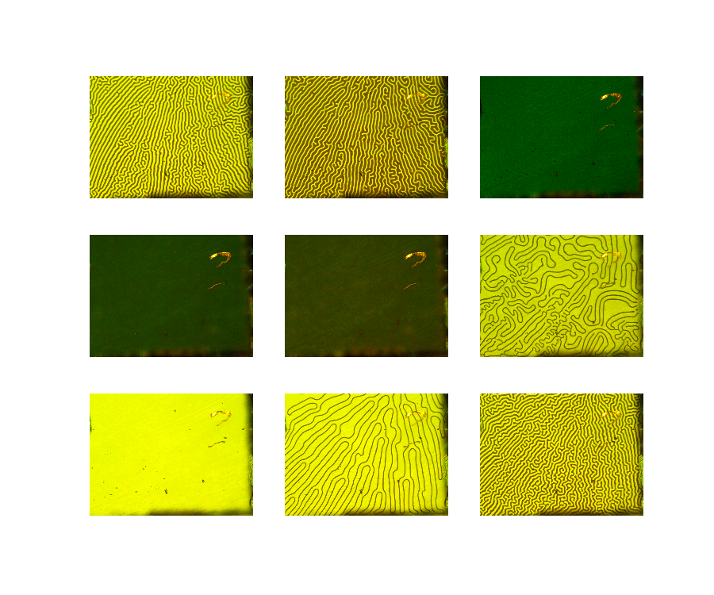

# Magnetic Domains Lab (2019 Advanced Physics Lab)

The following repository shows the image analysis process for the Magnetic Domains Lab.

Like all other labs in the class, we were given one week to research and understand the experiment, another week to perform and collect the data from the expirement and one last week to write a report on the process and results. 

This class and the Magnetic Domains lab specifically was my first introduction to image analysis using python.

